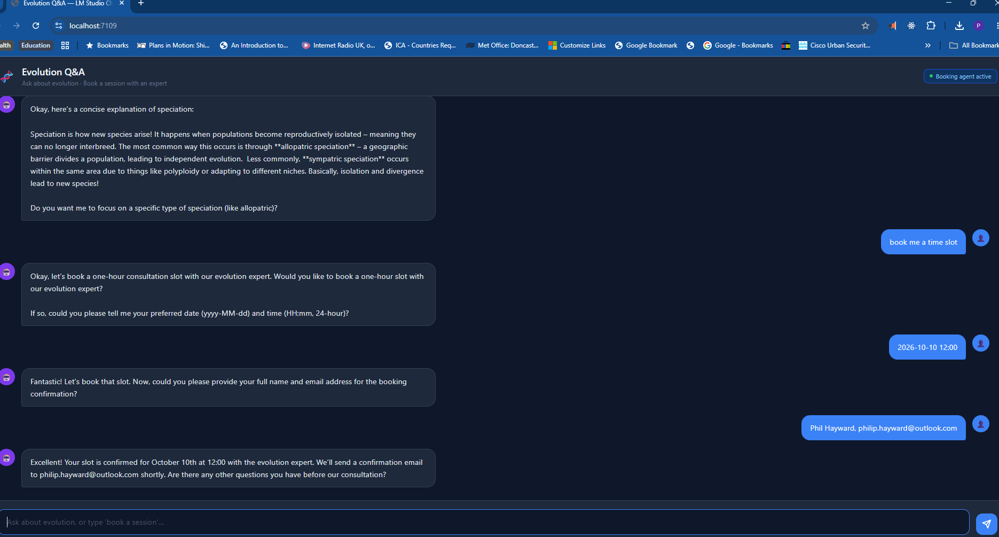

# LMClient — Evolution Q&A Chat with MCP Booking Agent

A local-first AI chat application that answers questions about the Theory of Evolution and lets users book a one-hour consultation slot with an evolution expert. Built entirely with C# / ASP.NET Core and powered by a locally-hosted LLM via [LM Studio](https://lmstudio.ai).



---

## What it does

- **Document Q&A** — answers natural-language questions about the Theory of Evolution, grounded in a bundled Markdown knowledge document. The model cannot hallucinate outside that document.
- **Booking agent** — a conversational flow that collects date, time, name and email, checks slot availability via an MCP tool call, and confirms (or declines) the booking.
- **Fully local** — the LLM runs on-device in LM Studio; no API keys, no cloud calls.

---

## Prompts used to build this project

| # | Prompt (condensed) |
|---|---|
| 1 | Create a C# web app chat client for LM Studio (local). Answer questions about a specific Markdown document supplied as a static file. Generate the document too — populate it with the Theory of Evolution. |
| 2 | Add a solution file (`.sln`) for Visual Studio and make sure it loads. |
| 3 | Add an MCP agent to handle booking a time slot with an evolution expert. Conversational flow: ask if they want to book → collect date/time → check schedule → confirm or apologise. No persistent memory needed. |
| 4 | Fix `System.InvalidOperationException: The node already has a parent` in the agentic loop. |

---

## Architecture

```
┌─────────────────────────────────────────────────────┐
│                   Browser (UI)                      │
│            wwwroot/index.html (dark theme)          │
│  • Multi-turn chat  • Suggestion pills              │
│  • "Booking agent active" badge                     │
└──────────────────────┬──────────────────────────────┘
                       │ HTTP POST /api/chat
                       ▼
┌─────────────────────────────────────────────────────┐
│             LMStudioChat (ASP.NET Core 9)           │
│                                                     │
│  1. Loads evolution.md at startup                   │
│  2. Connects to EvolutionBookingMcp via MCP stdio   │
│  3. Discovers booking tools (ListToolsAsync)        │
│  4. Agentic loop:                                   │
│     a) POST /v1/chat/completions → LM Studio        │
│     b) finish_reason == "tool_calls"?               │
│        → CallAsync on MCP server                    │
│        → append tool result, repeat                 │
│     c) Plain text reply → return to browser         │
└──────────┬─────────────────────┬───────────────────┘
           │ stdio (MCP)         │ HTTP (OpenAI-compat API)
           ▼                     ▼
┌─────────────────┐   ┌──────────────────────────────┐
│EvolutionBooking │   │        LM Studio              │
│Mcp (MCP Server) │   │  Any chat model with          │
│                 │   │  function-calling support      │
│ Tools:          │   │  Default: http://localhost:1234│
│ • check_        │   └──────────────────────────────┘
│   availability  │
│ • book_slot     │
│                 │
│ In-memory store │
│ (no persistence)│
└─────────────────┘
```

### Projects

| Project | Type | Role |
|---|---|---|
| `LMStudioChat` | ASP.NET Core 9 web app | Chat UI + MCP client + agentic loop orchestrator |
| `EvolutionBookingMcp` | Console app (MCP server, stdio) | Booking domain agent — owns schedule state and exposes tools |

### Key files

| File | Purpose |
|---|---|
| `LMStudioChat/Program.cs` | Startup, MCP client init, `/api/chat` endpoint with agentic loop |
| `LMStudioChat/Documents/evolution.md` | Knowledge document injected as system prompt context |
| `LMStudioChat/wwwroot/index.html` | Single-page chat UI |
| `LMStudioChat/appsettings.json` | LM Studio base URL (`http://localhost:1234`) |
| `EvolutionBookingMcp/Program.cs` | MCP server — `check_availability` and `book_slot` tools |

### Booking flow

```
User: "book me a time slot"
  ↓
Assistant: "Would you like to book a 1-hour slot with our evolution expert?"
  ↓
User: confirms, provides date/time (e.g. 2026-10-10 12:00)
  ↓
Assistant: "Could you give me your name and email?"
  ↓
User: provides name + email
  ↓
[LM Studio emits tool_call: check_availability(date, time)]
  ↓ MCP call → EvolutionBookingMcp
  ↓ "The slot on 2026-10-10 at 12:00 is available!"
  ↓
[LM Studio emits tool_call: book_slot(date, time, name, email)]
  ↓ MCP call → EvolutionBookingMcp
  ↓ "Booking confirmed! ..."
  ↓
Assistant: "Your slot is confirmed for October 10th at 12:00 ..."
```

---

## Hardware

The application runs fully locally. Tested on the following machine:

| Component | Detail |
|---|---|
| **Machine** | Tianbei GT68 mini PC |
| **CPU** | AMD Ryzen 7 PRO 6850H (8 cores / 16 threads, 3.2 GHz base) |
| **RAM** | 32 GB |
| **Integrated GPU** | AMD Radeon Graphics (integrated, shared memory) |
| **Discrete GPU** | NVIDIA GeForce RTX 5060 Ti (8 GB VRAM) |
| **OS** | Windows 11 Pro |
| **Runtime** | .NET 9 |
| **LLM host** | LM Studio (local server on port 1234) |

> The RTX 5060 Ti handles LLM inference in LM Studio via CUDA, enabling fast local responses without cloud dependency.

---

## Getting started

### Prerequisites

- [.NET 9 SDK](https://dotnet.microsoft.com/download)
- [LM Studio](https://lmstudio.ai) with a model loaded and the local server running on `http://localhost:1234`
  - The model must support **function calling / tool use**

### Run

```bash
cd LMStudioChat
dotnet run
```

The web app automatically spawns `EvolutionBookingMcp` as a child process — nothing else to start manually. Open your browser at the URL shown in the console (e.g. `http://localhost:5000`).

### Configuration

Edit `LMStudioChat/appsettings.json` to change the LM Studio address:

```json
{
  "LMStudio": {
    "BaseUrl": "http://localhost:1234"
  }
}
```

---

## Tech stack

| Layer | Technology |
|---|---|
| Web framework | ASP.NET Core 9 minimal API |
| MCP SDK | [ModelContextProtocol](https://www.nuget.org/packages/ModelContextProtocol) v1.4.0 |
| LLM API | OpenAI-compatible REST (LM Studio local server) |
| UI | Vanilla HTML/CSS/JS (no framework) |
| Transport | MCP stdio (parent → child process) |
